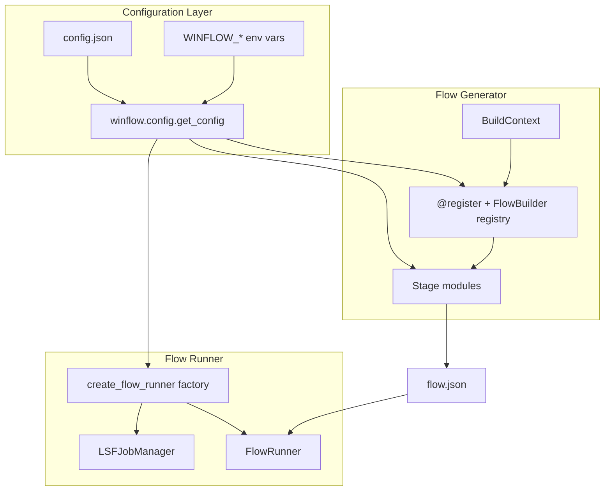

# WinFlow 2.0

WinFlow is a lightweight **EDA flow runner** for LSF clusters. You describe a design flow as JSON (stages/tasks as tags, jobs with `parents` / `children`, inputs, and outputs); WinFlow submits jobs with `bsub`, polls status with `bjobs`, validates inputs/outputs, and optionally visualizes progress in a Tkinter GUI.

A companion **flow generator** package builds `flow.json` from a simple example place-and-route style demo (`FLOOR_PLAN` → `PLACE` → `CTS` → `ROUTE` with `Q_*` checks), with a visual editor to export runnable JSON.

## Features

- **Declarative flows** — JSON config with stages, tasks, jobs, `parents` / `children`, inputs, outputs, queue, and CPU count
- **Centralized configuration** — site defaults in `config.json`, optional `WINFLOW_`* environment overrides
- **Flow generator** — CLI and GUI to build the bundled example flow (or blank custom flows)
- **Parent/child DAG scheduling** — ready jobs (all parents DONE) run in parallel; stage/task are organizational tags
- **LSF integration** — `bsub` / `bjobs` / `bkill` with per-job logs
- **CLI runner** — `python -m winflow.runner` for headless execution
- **Runner GUI** — DAG view, live status, log tailing, stop/rerun failed jobs (Runner tab)
- **Generator GUI** — visual flow editor; link/unlink edits `parents` / `children` (Generator tab)

## Requirements


| Component   | Notes                                   |
| ----------- | --------------------------------------- |
| Python 3.9.2+ | Standard library only (no pip packages); tested on 3.9 |
| LSF         | `bsub`, `bjobs`, `bkill` on `PATH`      |
| Tkinter     | For GUIs; usually bundled with Python   |
| C shell     | Example scripts use `#!/bin/csh`        |


Run all commands from the **repository root** so relative paths in `flow.json` resolve correctly.

## Quick start

### 1. Configure site defaults

Edit `config.json` at the project root. At minimum, set `runner.default_queue` and `generator.default_queue` to an LSF queue available on your cluster (the bundled default is `normal`).

```json
{
  "runner": {
    "default_queue": "your_queue",
    "poll_interval": 20
  },
  "generator": {
    "default_queue": "your_queue"
  }
}
```

You can also point to an alternate config file:

```bash
export WINFLOW_CONFIG=/path/to/my-site-config.json
```

### 2. Run from the command line

```bash
python -m winflow.runner flow.json
```

When no argument is given, the default flow file from `config.json` (`runner.default_flow_file`, currently `flow.json`) is used.

### 3. Run with the unified GUI (recommended)

```bash
python winflow_gui.py
# or: python -m winflow
```

One window with **Runner** and **Generator** tabs. Build a flow in Generator, then click **Sync from Generator** (next to Browse on the Runner top bar) to load it and reset all job statuses (only while no jobs are running).

### 4. Generate a flow (CLI)

```bash
python -m winflow.generator --flow example --setting example_flow/setting.sh -o flow.json
python -m winflow.generator --list          # list registered flow types (example)
```

## Repository layout

```
WinFlow2.0/
├── winflow_gui.py              # Sole root entry point (unified GUI)
├── config.json                 # Site-wide defaults (queue, paths, LSF, GUI)
├── flow.json                   # Active flow config (default for runners)
├── README.md
├── LICENSE
├── requirements.txt
├── assets/                     # App icons (PNG) + Linux .desktop template
├── example_flow/               # Dummy .csh scripts + setting.sh for the demo
├── tests/                      # Unit tests
├── log/                        # Per-job LSF stdout/stderr (created at runtime)
├── logs/                       # Flow-runner session logs (created at runtime)
└── winflow/                    # Application package
    ├── __main__.py             # python -m winflow → GUI
    ├── graph.py                # Shared parents/children DAG helpers
    ├── icon.py                 # Window icon helper
    ├── config/                 # Config loader and typed dataclasses
    ├── generator/              # Flow generation (CLI + builders)
    │   ├── __main__.py         # python -m winflow.generator
    │   ├── cli.py
    │   ├── core/
    │   ├── flows/example/
    │   ├── editor/             # FlowDocument, templates, job nodes helpers
    │   ├── node/               # Predefined Add-Job templates (*.json)
    │   └── parsers/
    ├── runner/                 # Headless LSF runner
    │   ├── __main__.py         # python -m winflow.runner
    │   ├── core.py
    │   ├── job_log_io.py
    │   └── lsf_jobs.py
    └── ui/                     # Tkinter panels
        ├── app.py              # Unified notebook window
        ├── generator.py        # Generator panel
        └── runner.py           # Runner panel
```

## Configuration

WinFlow uses a **two-tier configuration model**:


| Tier              | Source                                         | Purpose                                                                                   |
| ----------------- | ---------------------------------------------- | ----------------------------------------------------------------------------------------- |
| **Site defaults** | `config.json` + `WINFLOW_`* env vars           | Queue names, paths, poll intervals, script names — values that change per cluster or site |
| **Per-design**    | `setting.sh`, `flow.json`                      | Design-specific queue/CPU, job commands, I/O paths, and `parents` / `children` |


### Loading order

1. Built-in Python defaults in `winflow/config/models.py`
2. Values from `config.json` (merged recursively)
3. Environment variable overrides (see table below)

Access configuration in code:

```python
from winflow.config import get_config

cfg = get_config()
queue = cfg.runner.default_queue
poll  = cfg.runner.poll_interval
```

Reload after changing the config file:

```python
cfg = get_config(reload=True)
```

### `config.json` structure

#### `runner` — flow execution defaults


| Key                       | Default                | Description                                                                      |
| ------------------------- | ---------------------- | -------------------------------------------------------------------------------- |
| `default_flow_file`       | `flow.json`            | Default config path for CLI and runner GUI                                       |
| `session_log_dir`         | `logs`                 | Directory for session logs                                                       |
| `session_log_file`        | `logs/flow_runner.log` | CLI session log path                                                             |
| `job_log_dir`             | `log`                  | Per-job LSF stdout/stderr directory                                              |
| `poll_interval`           | `20`                   | Seconds between `bjobs` polls (also used when `flow.json` omits `poll_interval`) |
| `default_queue`           | `normal`               | LSF queue when a job has no `queue` field                                        |
| `default_cpu`             | `4`                    | CPU count when a job has no `cpu` field                                          |
| `logger_name`             | `FlowRunner`           | Python logger name                                                               |
| `kill_poll_ms`            | `15000`                | Milliseconds between kill-status checks in runner GUI                            |
| `kill_max_retries`        | `4`                    | Max kill attempts before giving up                                               |
| `log_tail_interval_sec`   | `0.5`                  | Log tail polling interval in runner GUI                                          |
| `thread_join_timeout_sec` | `1.0`                  | Thread join timeout for log tailer                                               |
| `log_viewer`              | `gvim`                 | External editor launched for job logs                                            |
| `auto_load_delay_ms`      | `150`                  | Delay before auto-loading config in runner GUI                                   |


#### `lsf` — LSF command configuration


| Key                         | Default         | Description                                |
| --------------------------- | --------------- | ------------------------------------------ |
| `bsub`                      | `bsub`          | Job submission command                     |
| `bjobs`                     | `bjobs`         | Status query command                       |
| `bkill`                     | `bkill`         | Job kill command                           |
| `bjobs_noheader`            | `true`          | Pass `-noheader` to `bjobs`                |
| `bjobs_output_field`        | `stat`          | Output field for `bjobs -o`                |
| `job_name_timestamp_format` | `%Y%m%d_%H%M%S` | `strftime` format for unique LSF job names |


#### `generator` — flow generator defaults


| Key                    | Default             | Description                                      |
| ---------------------- | ------------------- | ------------------------------------------------ |
| `default_flow_type`    | `example`                 | Default `--flow` argument for CLI                |
| `default_setting_file` | `example_flow/setting.sh` | Default path to csh settings file                |
| `default_blocks_file`  | `block_stream.list`       | Optional block list path (unused by example)     |
| `default_output_file`  | `flow.json`               | Default output path                              |
| `poll_interval`        | `20`                      | `poll_interval` written into generated flows     |
| `default_queue`        | `normal`                  | Default queue for templates and new jobs         |
| `default_cpu`          | `1`                       | Default CPU for templates                        |
| `blank_flow_name`      | `custom_flow`             | Flow name for the Blank template                 |
| `new_job_cpu`          | `1`                       | CPU for manually added jobs in the generator GUI |


#### `example` — bundled demo flow


| Key                 | Default                                              | Description                                      |
| ------------------- | ---------------------------------------------------- | ------------------------------------------------ |
| `flow_name`         | `example`                                            | Generated flow name                              |
| `main_stages`       | `FLOOR_PLAN`, `PLACE`, `CTS`, `ROUTE`                | Main chain stages (each gains a `Q_*` side job)  |
| `quality_prefix`    | `Q_`                                                 | Prefix for quality-check job names               |
| `script_dir`        | `example_flow`                                       | Directory containing dummy `.csh` scripts        |
| `out_dir`           | `example_flow/out`                                   | Directory for `.done` marker outputs             |
| `command_template`  | `./{script_dir}/{job_name}.csh`                      | Per-job command template                         |
| `output_template`   | `{out_dir}/{job_name}.done`                          | Per-job output path template                     |
| `default_queue`     | `normal`                                             | Fallback when `MACHINE_QUEUE` is absent          |
| `default_cpu`       | `1`                                                  | Fallback when `MACHINE_CPU` is absent            |


#### `gui` — window geometry


| Key                     | Default    | Description                     |
| ----------------------- | ---------- | ------------------------------- |
| `generator_window_size` | `1280x800` | Generator GUI initial size      |
| `generator_window_min`  | `960x640`  | Generator GUI minimum size      |
| `runner_window_size`    | `1280x820` | Runner GUI initial size         |
| `sidebar_min_width`     | `220`      | Generator sidebar minimum width |


### Environment variable overrides


| Variable                          | Config path               | Type                            |
| --------------------------------- | ------------------------- | ------------------------------- |
| `WINFLOW_CONFIG`                  | *(config file path)*      | path to alternate `config.json` |
| `WINFLOW_RUNNER_DEFAULT_QUEUE`    | `runner.default_queue`    | string                          |
| `WINFLOW_RUNNER_POLL_INTERVAL`    | `runner.poll_interval`    | int                             |
| `WINFLOW_RUNNER_DEFAULT_CPU`      | `runner.default_cpu`      | int                             |
| `WINFLOW_RUNNER_JOB_LOG_DIR`      | `runner.job_log_dir`      | string                          |
| `WINFLOW_RUNNER_SESSION_LOG_DIR`  | `runner.session_log_dir`  | string                          |
| `WINFLOW_GENERATOR_DEFAULT_QUEUE` | `generator.default_queue` | string                          |
| `WINFLOW_GENERATOR_POLL_INTERVAL` | `generator.poll_interval` | int                             |
| `WINFLOW_GENERATOR_DEFAULT_CPU`   | `generator.default_cpu`   | int                             |
| `WINFLOW_EXAMPLE_DEFAULT_QUEUE`   | `example.default_queue`   | string                          |
| `WINFLOW_EXAMPLE_DEFAULT_CPU`     | `example.default_cpu`     | string                          |


Example:

```bash
export WINFLOW_RUNNER_DEFAULT_QUEUE=short
export WINFLOW_EXAMPLE_DEFAULT_CPU=2
python -m winflow.runner
```

## Architecture

WinFlow is organized into three layers: configuration, flow generation, and flow execution.




### Design patterns


| Pattern                 | Where                                           | Purpose                                                                                             |
| ----------------------- | ----------------------------------------------- | --------------------------------------------------------------------------------------------------- |
| **Registry + Strategy** | `winflow.generator.core.registry`               | `@register("example")` decorates `FlowBuilder` subclasses; `get_builder(name)` returns the right builder |
| **BuildContext**        | `winflow.generator.core.context`                | Passes `settings`, `blocks`, and file paths into builders without global state                      |
| **Factory**             | `create_flow_runner()` in `winflow.runner.core` | Wires `FlowLogger`, `FlowValidator`, and `LSFJobManager`                                            |
| **Document model**      | `winflow.generator.editor.document`             | Editable `FlowDocument` with canvas positions, converted to runner-compatible JSON                  |
| **Shared DAG**          | `winflow.graph`                                 | `parents` / `children` edges, annotation helpers, and layer layout for both GUIs |


### Execution model

Jobs are scheduled **only** from each job’s `parents` / `children` attributes (keys are `stage/task/job`).

| Concept | Role |
| ------- | ---- |
| **Job** | Unit of LSF work. A job becomes ready when every parent is DONE (or skipped on Rerun). Ready jobs may run in parallel. |
| **Stage / task** | Tags for identity, logging, and editor grouping. They do **not** control run order or concurrency. |
| **inputs / outputs** | Safety checks at job start/end (paths must exist). They do **not** schedule jobs. |

When a flow is generated (or an older `flow.json` is missing relation fields), WinFlow **seeds** `parents` / `children` from:

1. Consecutive jobs in the same task (task order)
2. Matching file paths (`outputs` → `inputs`)

After that, the generator GUI **Link / Unlink** edits the attributes directly (and can auto-fill stage/task tags and file I/O). Canvas layout and the runner DAG view follow `parents` / `children` only.


> **Note:** Legacy flows without `parents` / `children` are annotated automatically at run time. Export from the editor preserves your link/unlink edits and does not re-seed over them.

### Adding a new flow type

1. Create a package under `winflow/generator/flows/myflow/`:
  ```
   winflow/generator/flows/myflow/
   ├── __init__.py
   ├── builder.py      # @register("myflow") class MyFlowBuilder(FlowBuilder)
   ├── config.py       # optional: domain config from BuildContext
   └── stages/         # pure functions returning Stage dicts
  ```
2. Implement `validate_context()` and `build()` on your `FlowBuilder` subclass.
3. Register by importing the module in `winflow/generator/flows/__init__.py`:
  ```python
   from winflow.generator.flows import example, myflow  # noqa: F401
  ```
4. Add flow-specific defaults to `config.json` under a `myflow` section and read them via `get_config()`.
5. Optionally add a GUI template in `winflow/generator/editor/document.py`.

## Flow configuration (`flow.json`)

Top-level keys:


| Key             | Required | Default                   | Description                   |
| --------------- | -------- | ------------------------- | ----------------------------- |
| `flow_name`     | yes      | —                         | Display name for the flow     |
| `stages`        | yes      | —                         | Ordered list of stages        |
| `poll_interval` | no       | `20` (from `config.json`) | Seconds between `bjobs` polls |


Each **stage** has `name` and `tasks` (organizational tags). Each **task** has `name` and `jobs`. Each **job** has:


| Key        | Required | Default                       | Description                                                                 |
| ---------- | -------- | ----------------------------- | --------------------------------------------------------------------------- |
| `name`     | yes      | —                             | Template name (LSF job name gets a user/timestamp suffix)                  |
| `command`  | yes      | —                             | Shell command submitted to LSF                                             |
| `inputs`   | yes      | —                             | Paths that must exist before submission                                    |
| `outputs`  | yes      | —                             | Paths that must exist after `DONE`                                         |
| `parents`  | no*      | seeded if missing             | List of parent job keys (`stage/task/job`); drives scheduling              |
| `children` | no*      | seeded if missing             | List of child job keys (`stage/task/job`); kept mutual with `parents`      |
| `queue`    | no       | `normal` (from `config.json`) | LSF queue                                                                  |
| `cpu`      | no       | `4` (from `config.json`)      | CPU count (`bsub -n`)                                                      |
| `machine`  | no       | —                             | Space-separated host list for `bsub -m`                                    |

\*Generated and exported flows include `parents` / `children`. Older files without them are annotated at generate/run time.


Example (abbreviated):

```json
{
  "flow_name": "example",
  "poll_interval": 20,
  "stages": [
    {
      "name": "FLOOR_PLAN",
      "tasks": [
        {
          "name": "FLOOR_PLAN",
          "jobs": [
            {
              "name": "FLOOR_PLAN",
              "command": "./example_flow/FLOOR_PLAN.csh",
              "queue": "normal",
              "cpu": 1,
              "inputs": [],
              "outputs": ["example_flow/out/FLOOR_PLAN.done"],
              "parents": [],
              "children": [
                "FLOOR_PLAN/Q_FLOOR_PLAN/Q_FLOOR_PLAN",
                "PLACE/PLACE/PLACE"
              ]
            }
          ]
        }
      ]
    }
  ]
}
```

## Flow generator

### CLI

```bash
python -m winflow.generator [options]

Options:
  --flow FLOW       Flow type to generate (default: example)
  --setting PATH    Path to setting.sh (default: example_flow/setting.sh)
  --blocks PATH     Path to block_stream.list (optional; unused by example)
  -o, --output PATH Output flow.json path (default: flow.json)
  --list            List registered flow types and exit
```

Registered flow types: `example`.

### `setting.sh` format

csh-style `set` lines parsed by `winflow/generator/parsers/setting_sh.py`:

```csh
set DESIGN = "demo_chip"
set MACHINE_QUEUE = "normal"
set MACHINE_CPU = "1"
set MACHINE_HOST = ""
```

### Generator GUI templates


| Template    | Description                                                              |
| ----------- | ------------------------------------------------------------------------ |
| **Blank**   | Single stage/task/job scaffold for custom flows                          |
| **example** | Demo chain `FLOOR_PLAN` → `PLACE` → `CTS` → `ROUTE` with `Q_*` side jobs |


## Bundled example flow

The `example_flow/` directory contains dummy `.csh` scripts for the registered `example` generator. Each main stage writes `example_flow/out/{STAGE}.done`; each `Q_*` job checks the parent stage marker and writes its own `.done` file. The main chain does not wait on quality checks:

```
FLOOR_PLAN -> PLACE -> CTS -> ROUTE
     |          |       |       |
  Q_FLOOR_PLAN Q_PLACE Q_CTS  Q_ROUTE
```


| Stage      | Jobs                         | Command                              | Output                          |
| ---------- | ---------------------------- | ------------------------------------ | ------------------------------- |
| FLOOR_PLAN | `FLOOR_PLAN`, `Q_FLOOR_PLAN` | `./example_flow/{job}.csh`           | `example_flow/out/{job}.done`   |
| PLACE      | `PLACE`, `Q_PLACE`           | `./example_flow/{job}.csh`           | `example_flow/out/{job}.done`   |
| CTS        | `CTS`, `Q_CTS`               | `./example_flow/{job}.csh`           | `example_flow/out/{job}.done`   |
| ROUTE      | `ROUTE`, `Q_ROUTE`           | `./example_flow/{job}.csh`           | `example_flow/out/{job}.done`   |


## Logging


| Location                           | Contents           |
| ---------------------------------- | ------------------ |
| `log/{user}_{job}_{timestamp}.log` | LSF stdout per job |
| `log/{user}_{job}_{timestamp}.err` | LSF stderr per job |
| `logs/flow_runner.log`             | CLI session log    |
| `logs/flow_YYYYMMDD_HHMMSS.log`    | GUI session log    |


Log directories are configurable via `runner.job_log_dir` and `runner.session_log_dir` in `config.json`.

The runner GUI **Reset Flow** button clears log files under both log directories, resets every job on the DAG to waiting, and drops local LSF tracking (registry / kill monitor). It does not send ``bkill``.

## GUI controls

### Unified GUI (`winflow_gui.py`)


| Control                  | Action                                                                 |
| ------------------------ | ---------------------------------------------------------------------- |
| **Runner / Generator tabs** | Switch between run view and visual editor                           |
| **Sync from Generator**  | Top bar (next to Browse): apply Generator’s in-memory flow into Runner; writes `flow.json`, resets all job statuses; disabled while any job is running / RUN / KILLING |

Window icons use PNG under `assets/` via Tk `iconphoto` (works on Linux/X11). For a desktop launcher, copy `assets/winflow.desktop.in` to `~/.local/share/applications/winflow.desktop` and replace the absolute `Exec=` / `Icon=` paths.


### Runner GUI (Runner tab / `winflow.ui.runner`)


| Control            | Action                                                                         |
| ------------------ | ------------------------------------------------------------------------------ |
| **Run Flow**       | Execute the loaded config from the beginning                                   |
| **Rerun**          | Resume from the first failed job, skipping completed jobs                      |
| **Stop**           | `bkill` all tracked LSF jobs (retries per `kill_poll_ms` / `kill_max_retries`) |
| **Job node click** | Open detail dialog: Run Job, Stop Job, Validate, inputs/outputs, timing |
| **Job Log tab**    | Tail active job logs; select a job from the dropdown                           |


### Generator GUI (Generator tab / `winflow.ui.generator`)


| Control              | Action                                                    |
| -------------------- | --------------------------------------------------------- |
| **Add / Edit Job**   | Pick a predefined node from `winflow/generator/node/*.json` (or blank), then edit |
| **Link / Unlink**    | Edit `parents` / `children`; auto-fills stage/task tags and file I/O when useful |
| **Drag nodes**       | Arrange the canvas; auto-layout follows parent/child layers |
| **Load Template**    | Load Blank or example template with LSF resource options |
| **Export flow.json** | Write the current document as runnable JSON (keeps relation edits) |


## Tests

```bash
# Prefer the project Python (3.9.2+):
python3.9 -m unittest discover -s tests -v
```

Tests cover flow builders, CLI, parsers, config loading, LSF submit options, GUI document/graph/deps helpers, parent/child DAG scheduling, and the shared DAG module.

## License

CC0 1.0 Universal — see [LICENSE](LICENSE).