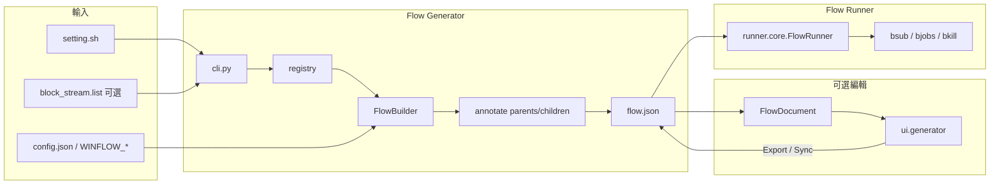
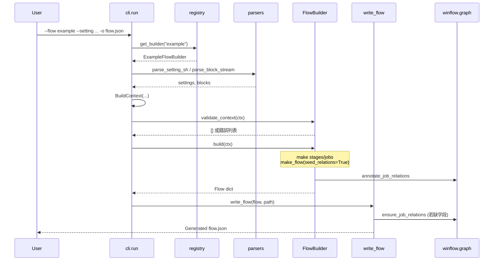

# WinFlow Flow Generator：設計與工作原理（詳解）

> 本文檔面向需要理解、維護或擴展 **Flow Generator（流程生成器）** 的開發者與使用者。  
> 對應代碼包：`winflow/generator/`（CLI、構建器、編輯器輔助層），以及與之緊密耦合的共享圖模塊 `winflow/graph.py`、統一 GUI 中的 Generator 面板 `winflow/ui/generator.py`。

---

## 目錄

1. [定位與目標](#1-定位與目標)
2. [在整個 WinFlow 中的位置](#2-在整個-winflow-中的位置)
3. [代碼包結構總覽](#3-代碼包結構總覽)
4. [核心設計原則](#4-核心設計原則)
5. [數據模型：Flow / Stage / Task / Job](#5-數據模型flow--stage--task--job)
6. [架構模式：Registry + Strategy + BuildContext](#6-架構模式registry--strategy--buildcontext)
7. [CLI 生成流水線（逐步拆解）](#7-cli-生成流水線逐步拆解)
8. [輸入解析器](#8-輸入解析器)
9. [內置 Example Flow Builder 詳解](#9-內置-example-flow-builder-詳解)
10. [parents / children：調度關係的種子與語義](#10-parents--children調度關係的種子與語義)
11. [配置系統如何驅動生成器](#11-配置系統如何驅動生成器)
12. [編輯器層（editor）：可視化編輯的內存模型](#12-編輯器層editor可視化編輯的內存模型)
13. [Job Node 模板庫](#13-job-node-模板庫)
14. [GUI 層如何調用生成器](#14-gui-層如何調用生成器)
15. [輸出產物：flow.json 完整說明](#15-輸出產物flowjson-完整說明)
16. [與 Runner 的契約](#16-與-runner-的契約)
17. [如何擴展一種新的 Flow Type](#17-如何擴展一種新的-flow-type)
18. [端到端示例](#18-端到端示例)
19. [常見誤解與排錯](#19-常見誤解與排錯)
20. [關鍵文件索引](#20-關鍵文件索引)

---

## 1. 定位與目標

### 1.1 Flow Generator 是什麼

Flow Generator 的職責是：

> **把“領域輸入 + 站點配置”轉換成一份可被 Runner 執行的** `flow.json`**。**

它不是調度器，也不提交 LSF 作業。它只負責**構造流程文檔**：

- 有哪些 stage / task / job
- 每個 job 的 `command`、`queue`、`cpu`、`inputs`、`outputs`
- 每個 job 的 `parents` / `children`（調度 DAG）

### 1.2 爲什麼需要 Generator

手動手寫一份完整 `flow.json` 是可行的，但在真實 EDA 場景中：

- 階段很多、依賴複雜
- 命令路徑、輸出 marker、隊列 CPU 等常隨站點/項目變化
- 需要在 GUI 中可視化編輯後再導出

因此 WinFlow 把“構造流程”獨立成 Generator：


| 路徑                                  | 用途            |
| ----------------------------------- | ------------- |
| CLI：`python -m winflow.generator`   | 批量/腳本化生成      |
| GUI Generator 面板                    | 可視化加載模板、連線、導出 |
| 代碼 API：`FlowBuilder.build(context)` | 測試與二次集成       |


### 1.3 當前版本的“內置流程”

當前 clean 版本只內置一種註冊流程類型：

- `example`：演示用的 APR 風格鏈路

```
FLOOR_PLAN -> PLACE -> CTS -> ROUTE
     |          |       |       |
  Q_FLOOR_PLAN Q_PLACE Q_CTS  Q_ROUTE
```

主階段串行推進；每個主階段旁掛一個 `Q_*` 質檢 job（不阻塞下一主階段）。

---

## 2. 在整個 WinFlow 中的位置




**一句話**：Generator 產出 JSON；Runner 消費 JSON；兩者通過 `parents/children + inputs/outputs` 契約解耦。

---

## 3. 代碼包結構總覽

```
winflow/generator/
├── __init__.py
├── __main__.py              # python -m winflow.generator
├── cli.py                   # 命令行入口與流水線編排
├── core/
│   ├── builder.py           # FlowBuilder 抽象基類
│   ├── registry.py          # @register / get_builder / list_flows
│   ├── context.py           # BuildContext
│   ├── models.py            # Flow/Stage/Task/Job + make_* 工廠
│   └── io.py                # write_flow
├── parsers/
│   ├── setting_sh.py        # 解析 csh set 語句
│   └── block_stream.py      # 解析 block 列表（當前 example 未強制使用）
├── flows/
│   ├── __init__.py          # import 子模塊以觸發註冊
│   └── example/
│       ├── __init__.py
│       └── builder.py       # ExampleFlowBuilder
├── editor/                  # GUI 編輯器的文檔/依賴/佈局輔助（非 Tk 本體）
│   ├── document.py          # FlowDocument、模板加載、導出排序
│   ├── deps.py              # link/unlink parents/children
│   ├── graph.py             # 畫布 JobGraph / layout
│   └── nodes.py             # node/*.json 模板庫讀寫
└── node/                    # Add Job 預置節點 JSON
    ├── blank_job.json
    ├── FLOOR_PLAN.json
    ├── Q_FLOOR_PLAN.json
    └── ...
```

相關但不屬於 `generator/` 包、卻被其強依賴的模塊：


| 模塊                        | 作用                                                 |
| ------------------------- | -------------------------------------------------- |
| `winflow/graph.py`        | 從 task-order + 文件 I/O 派生邊；寫入/校驗 `parents/children` |
| `winflow/config/`         | `generator` / `example` 等配置段                       |
| `winflow/ui/generator.py` | Tkinter Generator 面板（調用 editor + core）             |


---

## 4. 核心設計原則

### 4.1 生成與執行分離

- Generator **不知道** LSF、`bsub`、輪詢細節
- Runner **不知道** example 階段如何拼裝
- 唯一契約是 `flow.json` 的結構與語義

### 4.2 Stage / Task 只是組織標籤

在 WinFlow 的執行模型中：

- **真正控制先後與並行的是 job 的** `parents` **/** `children`
- `stage` / `task` 用於：
  - job 身份鍵：`stage/task/job`
  - 日誌與 GUI 分組
  - 編輯器中的標籤管理

這意味着：即使兩個 job 在不同 stage，只要 DAG 上無就緒，也可以並行提交。

### 4.3 inputs / outputs 不做調度

- `inputs`：job **啓動前**必須已存在的路徑（安全檢查）
- `outputs`：job **結束後**必須產生的路徑（完成校驗）
- **調度**只看 `parents` 是否全部 DONE

但 Generator 會利用 inputs/outputs 的匹配關係，在生成時**種子化** parents/children（見第 10 節）。

### 4.4 可插拔 Flow Type（Strategy）

每種流程類型實現一個 `FlowBuilder` 子類，並用 `@register("name")` 註冊。  
CLI / GUI 通過名字查找 builder，互不影響。

### 4.5 配置驅動，而不是硬編碼站點細節

隊列、CPU、腳本目錄、輸出模板等儘量來自：

1. `winflow/config/models.py` 默認值
2. 根目錄 `config.json`
3. 環境變量 `WINFLOW_*`
4. 設計級 `setting.sh`（覆蓋 MACHINE_QUEUE 等）

---

## 5. 數據模型：Flow / Stage / Task / Job

定義位置：`winflow/generator/core/models.py`。

### 5.1 層級關係

```
Flow
 └── stages[] : Stage
      └── tasks[] : Task
           └── jobs[] : Job
```

### 5.2 字段說明

#### Flow


| 字段              | 類型   | 含義                      |
| --------------- | ---- | ----------------------- |
| `flow_name`     | str  | 流程顯示名（如 `"example"`）    |
| `poll_interval` | int  | Runner 輪詢 `bjobs` 的間隔秒數 |
| `stages`        | list | 有序 stage 列表             |


#### Stage / Task


| 字段               | 含義             |
| ---------------- | -------------- |
| `name`           | 標籤名；參與 job key |
| `tasks` / `jobs` | 子列表            |


#### Job（核心）


| 字段         | 是否必需  | 含義                            |
| ---------- | ----- | ----------------------------- |
| `name`     | 是     | job 名（LSF 提交名會再加用戶/時間戳後綴）     |
| `command`  | 是     | 提交給 LSF 的 shell 命令            |
| `queue`    | 是     | LSF 隊列                        |
| `cpu`      | 是     | `bsub -n`                     |
| `inputs`   | 是     | 啓動前必須存在的路徑列表                  |
| `outputs`  | 是     | 結束後必須存在的路徑列表                  |
| `parents`  | 運行時必需 | 父 job key 列表，`stage/task/job` |
| `children` | 運行時必需 | 子 job key 列表，與 parents 互逆     |
| `machine`  | 可選    | `bsub -m` 主機列表                |


### 5.3 工廠函數

爲避免各 builder 手寫 dict 結構不一致，提供：

- `make_job(...)`：默認帶空 `parents`/`children`
- `make_task(name, jobs)`
- `make_stage(name, tasks)`
- `make_flow(name, stages, poll_interval=..., seed_relations=True)`

`make_flow` 是關鍵樞紐：

```python
if seed_relations:
    annotate_job_relations(stages)   # 生成器路徑：強制從 I/O + task-order 種子化
else:
    ensure_job_relations(stages)     # 編輯器導出：僅在字段缺失時補齊，不覆蓋用戶連線
```

---

## 6. 架構模式：Registry + Strategy + BuildContext

### 6.1 FlowBuilder（Strategy）

`winflow/generator/core/builder.py`：

```python
class FlowBuilder(ABC):
    flow_type: ClassVar[str] = ""

    @classmethod
    @abstractmethod
    def validate_context(cls, context: BuildContext) -> List[str]:
        ...

    @classmethod
    @abstractmethod
    def build(cls, context: BuildContext) -> Flow:
        ...
```

約定：

- **類方法**：builder 無狀態；所有輸入來自 `BuildContext` + `get_config()`
- `validate_context`：返回錯誤字符串列表；空列表表示通過
- `build`：返回完整 `Flow` dict

### 6.2 Registry（註冊表）

`winflow/generator/core/registry.py`：

```python
@register("example")
class ExampleFlowBuilder(FlowBuilder):
    ...
```

機制要點：

1. `@register(name)` 把類登記到模塊級 `_REGISTRY`（key 統一小寫）
2. 同時寫入 `cls.flow_type`
3. 禁止同名不同類重複註冊
4. `get_builder("EXAMPLE")` 與 `get_builder("example")` 等價
5. `list_flows()` 返回已註冊名稱排序列表

**註冊觸發方式**：必須 import 實現模塊。  
`cli.py` 與 `flows/__init__.py` 中有：

```python
from winflow.generator.flows import example  # noqa: F401
```

這行代碼的副作用就是讓 `@register` 裝飾器執行。

### 6.3 BuildContext（構建上下文）

`winflow/generator/core/context.py`：

```python
@dataclass
class BuildContext:
    settings: Dict[str, str]          # setting.sh 解析結果
    blocks: List[Dict[str, str]]      # block_stream.list 解析結果
    setting_path: Path
    blocks_path: Path
    output_path: Path
```

設計意圖：

- 把“文件路徑 + 已解析內容”打包，避免 builder 自己讀文件、散落全局狀態
- 當前 `example` builder 主要用 `settings`（隊列/CPU/主機）；`blocks` 預留給更復雜 flow type

---

## 7. CLI 生成流水線（逐步拆解）

入口：

```bash
python -m winflow.generator [選項]
# 等價
python -m winflow.generator.cli
```

實現：`winflow/generator/cli.py` 的 `run()`。

### 7.1 參數


| 參數            | 默認（來自 config）                            | 含義               |
| ------------- | ---------------------------------------- | ---------------- |
| `--flow`      | `generator.default_flow_type`（`example`） | 流程類型名            |
| `--setting`   | `example_flow/setting.sh`                | csh 設置文件         |
| `--blocks`    | `block_stream.list`                      | block 列表（可缺失）    |
| `-o/--output` | `flow.json`                              | 輸出路徑             |
| `--list`      | —                                        | 只打印已註冊 flow type |


### 7.2 執行步驟（按代碼順序）




逐步說明：

1. **解析參數**
  默認值全部來自 `get_config().generator`，因此改 `config.json` 即可改變 CLI 默認行爲。
2. `--list` **短路**
  打印註冊表後返回 0。
3. **查找 Builder**
  未知 flow type → stderr 報錯，返回碼 1。
4. **檢查 setting 文件存在**
  setting 是硬性要求；blocks 文件允許不存在（解析器返回空列表）。
5. **構造 BuildContext**
  把解析結果與路徑一併傳入。
6. **validate_context**
  任一錯誤打印後返回 1。  
   當前 `ExampleFlowBuilder.validate_context` 恆返回 `[]`（無強制字段）。
7. **build**
  組裝 stages，並在 `make_flow(..., seed_relations=True)` 中完成 DAG 種子化。
8. **write_flow**
  JSON 縮進寫入；再次 `ensure_job_relations` 兜底。
9. **成功輸出**
  `Generated <path>`，返回 0。

### 7.3 返回碼約定


| 碼   | 含義                         |
| --- | -------------------------- |
| 0   | 成功或 `--list` 成功            |
| 1   | 未知 flow / 缺 setting / 校驗失敗 |


---

## 8. 輸入解析器

### 8.1 `setting.sh`（csh 風格）

文件：`winflow/generator/parsers/setting_sh.py`

只識別這種行：

```csh
set KEY = "value"
```

規則：

- 忽略空行與 `#` 註釋
- 正則：`^\s*set\s+(\S+)\s*=\s*"(.*)"\s*$`
- 返回 `Dict[str, str]`

示例（倉庫自帶 `example_flow/setting.sh`）：

```csh
set DESIGN = "demo_chip"
set MACHINE_QUEUE = "normal"
set MACHINE_CPU = "1"
set MACHINE_HOST = ""
```

對 `example` builder 有意義的鍵：


| Key             | 用途                |
| --------------- | ----------------- |
| `MACHINE_QUEUE` | 覆蓋默認隊列            |
| `MACHINE_CPU`   | 覆蓋默認 CPU          |
| `MACHINE_HOST`  | 可選，寫入 job.machine |


> 注意：沒有引號的 `set FOO = bar` **不會**被解析。必須用雙引號。

### 8.2 `block_stream.list`

文件：`winflow/generator/parsers/block_stream.py`

格式：

```
# 註釋
block_name /path/to/workdir
```

- 文件不存在 → 返回 `[]`（不報錯）
- 每行至少兩列：`name`、`workdir`
- 當前 `example` builder **不消費** blocks；該解析器是爲可擴展 flow type 保留的穩定接口

---

## 9. 內置 Example Flow Builder 詳解

文件：`winflow/generator/flows/example/builder.py`

### 9.1 目標拓撲

```
FLOOR_PLAN ──► PLACE ──► CTS ──► ROUTE
    │            │         │        │
    ▼            ▼         ▼        ▼
Q_FLOOR_PLAN  Q_PLACE   Q_CTS    Q_ROUTE
```

語義：

- 主鏈：後一主階段依賴前一主階段的 **主輸出**（不是 Q_* 輸出）
- 旁鏈：`Q_X` 依賴 `X` 的輸出；不進入主鏈下一跳

因此運行時：

- `PLACE` 可與 `Q_FLOOR_PLAN` **並行**（兩者都以 `FLOOR_PLAN` 爲父）
- `CTS` 只等 `PLACE`，不等 `Q_PLACE`

### 9.2 階段/任務/作業的命名約定

對每個主階段名 `S ∈ {FLOOR_PLAN, PLACE, CTS, ROUTE}`：


| 概念      | 名稱                          |
| ------- | --------------------------- |
| Stage   | `S`                         |
| 主 Task  | `S`                         |
| 主 Job   | `S`                         |
| 質檢 Task | `Q_S`（`quality_prefix + S`） |
| 質檢 Job  | `Q_S`                       |


也就是說，很多時候 stage/task/job 三者同名，便於閱讀與 key 拼接。

### 9.3 命令與輸出模板（配置化）

來自 `get_config().example`：


| 配置項                | 默認                              | 作用           |
| ------------------ | ------------------------------- | ------------ |
| `script_dir`       | `example_flow`                  | 腳本目錄         |
| `out_dir`          | `example_flow/out`              | `.done` 輸出目錄 |
| `command_template` | `./{script_dir}/{job_name}.csh` | 命令           |
| `output_template`  | `{out_dir}/{job_name}.done`     | 輸出 marker    |
| `quality_prefix`   | `Q_`                            | 質檢名前綴        |
| `main_stages`      | 四元組                             | 主階段順序        |


因此：

- 主 job `PLACE` → 命令 `./example_flow/PLACE.csh`，輸出 `example_flow/out/PLACE.done`
- 質檢 `Q_PLACE` → 命令 `./example_flow/Q_PLACE.csh`，輸入/輸出同理

### 9.4 I/O 如何編碼依賴

`build_example_stages()` 核心邏輯：

```text
prev_output = None
for each main_name:
    main_job.inputs  = [prev_output] if prev_output else []
    main_job.outputs = [out(main_name)]
    q_job.inputs     = [main_job.outputs[0]]
    q_job.outputs    = [out(Q_main)]
    prev_output      = main_job.outputs[0]   # 注意：下一主階段接主輸出，不是 Q 輸出
```

舉例：


| Job          | inputs                | outputs                            |
| ------------ | --------------------- | ---------------------------------- |
| FLOOR_PLAN   | `[]`                  | `example_flow/out/FLOOR_PLAN.done` |
| Q_FLOOR_PLAN | `.../FLOOR_PLAN.done` | `.../Q_FLOOR_PLAN.done`            |
| PLACE        | `.../FLOOR_PLAN.done` | `.../PLACE.done`                   |
| Q_PLACE      | `.../PLACE.done`      | `.../Q_PLACE.done`                 |
| …            | …                     | …                                  |


之後 `annotate_job_relations` 看到：

- 同文件邊：`FLOOR_PLAN → Q_FLOOR_PLAN`、`FLOOR_PLAN → PLACE`
- 於是寫出雙向 `parents/children`

### 9.5 `build()` 讀取設置的優先級

```python
queue = settings.get("MACHINE_QUEUE", cfg.default_queue)
cpu   = settings.get("MACHINE_CPU",   cfg.default_cpu)
machine = settings.get("MACHINE_HOST", "")
```

即：**setting.sh > example 配置默認值**。

### 9.6 與磁盤腳本的對應關係

`example_flow/*.csh` 是演示用 dummy 腳本：

- 檢查上游 `.done`（若需要）
- `mkdir -p example_flow/out`
- `sleep` 一小段時間
- 寫出自己的 `.done`

Generator **不執行**這些腳本；它只是把命令字符串寫進 JSON。真正執行發生在 Runner + LSF。

---

## 10. parents / children：調度關係的種子與語義

共享實現：`winflow/graph.py`。

### 10.1 Job Key 格式

持久化與 Runner 使用的 key：

```text
stage/task/job
```

例如：

```text
FLOOR_PLAN/FLOOR_PLAN/FLOOR_PLAN
FLOOR_PLAN/Q_FLOOR_PLAN/Q_FLOOR_PLAN
PLACE/PLACE/PLACE
```

GUI 編輯器內部爲了避免 `/` 與名稱衝突，使用 NUL 分隔：

```text
stage\0task\0job
```

轉換函數：`key_to_slash` / `slash_to_key`。

### 10.2 種子化算法 `annotate_job_relations`

步驟：

1. 遍歷所有 job，建立：
  - **task-order 邊**：同一 `(stage, task)` 內，列表中相鄰 job 前→後
  - **output 生產者表**：`output_path → job_key`
2. 再遍歷所有 job 的 `inputs`：若某 input 能在生產者表找到別的 job，則加 **文件邊**
3. 把邊轉成鄰接表，寫回每個 job 的 `parents` / `children`（slash key，去重保序）

僞代碼：

```text
edges = []
for each task:
    for consecutive jobs a, b in task:
        edges += a → b   (label: "(task order)")
for each job j:
    for inp in j.inputs:
        if producer[inp] exists and producer != j:
            edges += producer → j   (label: inp path)

parents[j] / children[j] = adjacency(edges)
```

### 10.3 `ensure_job_relations` vs `annotate_job_relations`


| 函數                       | 行爲                                              |
| ------------------------ | ----------------------------------------------- |
| `annotate_job_relations` | **總是**按算法重寫 parents/children                    |
| `ensure_job_relations`   | 僅當有 job 缺少 `parents` 或 `children` 字段時才 annotate |
| `strip_job_relations`    | 刪掉這兩個字段（node 模板庫用）                              |


因此：

- **CLI 生成**：`make_flow(seed_relations=True)` → 強制 annotate（符合 builder 設計的 I/O 依賴）
- **GUI 導出**：`document_to_flow` → `make_flow(seed_relations=False)` → 保留用戶 Link/Unlink 結果

### 10.4 爲什麼 example 能得到“旁路不擋主鏈”

因爲 PLACE 的 input 指向 `FLOOR_PLAN.done`，而不是 `Q_FLOOR_PLAN.done`。  
文件邊只會連到真正生產該路徑的 job。

若誤把 PLACE 的 input 寫成 `Q_FLOOR_PLAN.done`，則主鏈會被質檢阻塞——這是 I/O 設計問題，不是調度器 bug。

### 10.5 互逆一致性

`validate_job_relations` 會檢查：

- parents/children 是否互相包含
- 是否指向不存在的 job
- 是否存在環

Runner 啓動前也會做類似校驗。

---

## 11. 配置系統如何驅動生成器

### 11.1 兩段相關配置

#### `generator`（通用生成器默認）


| 鍵                               | 默認                        | 影響                    |
| ------------------------------- | ------------------------- | --------------------- |
| `default_flow_type`             | `example`                 | CLI `--flow` 默認       |
| `default_setting_file`          | `example_flow/setting.sh` | CLI `--setting` 默認    |
| `default_blocks_file`           | `block_stream.list`       | CLI `--blocks` 默認     |
| `default_output_file`           | `flow.json`               | CLI `-o` 默認           |
| `poll_interval`                 | `20`                      | 寫入 Flow.poll_interval |
| `default_queue` / `default_cpu` | 隊列/CPU                    | GUI blank 模板等         |
| `blank_flow_name`               | `custom_flow`             | Blank 模板 flow_name    |
| `new_job_cpu`                   | `1`                       | 手動 Add Job 默認 CPU     |


#### `example`（example builder 專用）

見第 9.3 節表格。

### 11.2 加載順序

1. `models.py` 數據類默認值
2. 根目錄 `config.json` 遞歸合併
3. 環境變量覆蓋（如 `WINFLOW_GENERATOR_DEFAULT_QUEUE`、`WINFLOW_EXAMPLE_DEFAULT_CPU`）

`get_config()` 有進程內緩存；測試中用 `reset_config()` 清緩存。

### 11.3 設計級 vs 站點級


| 層級     | 載體            | 例子                |
| ------ | ------------- | ----------------- |
| 站點/集羣  | `config.json` | 默認隊列名、腳本目錄模板      |
| 設計/項目  | `setting.sh`  | 該次運行的 MACHINE_CPU |
| 一次生成結果 | `flow.json`   | 固化後的 job 列表與 DAG  |


---

## 12. 編輯器層（editor）：可視化編輯的內存模型

GUI 不直接改 JSON 字符串，而是操作 `FlowDocument`。

### 12.1 `FlowDocument`

文件：`winflow/generator/editor/document.py`

額外於 Flow 的字段：

- `positions: Dict[JobKey, (x, y)]`：畫布座標（NUL key）

主要能力：

- `iter_jobs` / `get_job` / `add_job` / `remove_job` / `update_job`
- stage/task 自動創建與搬遷
- 重命名時重寫 relation key（調用 `rewrite_relation_key_refs`）

### 12.2 模板系統

`apply_template(name, options)`：


| 模板名                        | 行爲                                                 |
| -------------------------- | -------------------------------------------------- |
| `blank`                    | 單 stage/task/job 腳手架                               |
| `example` / `example_flow` | 調用 `ExampleFlowBuilder.build`，再 `flow_to_document` |


`TemplateOptions`：

- `queue` / `machine` / `cpu`
- 可選 `setting_path`

`example_template` 的細節：

1. 先用對話框資源構造 settings
2. 若提供 setting.sh，則 parse 後合併，但對話框的 queue/cpu/machine **最終覆蓋**
3. `ExampleFlowBuilder.build`
4. `apply_job_resources` 再統一寫回所有 job 的隊列資源

### 12.3 導入 / 導出

#### `flow_to_document(flow)`

- deepcopy stages
- `ensure_job_relations`（缺字段才種子化）
- 自動佈局 `auto_layout_all`

#### `document_to_flow(document)`

1. `ensure_unique_stage_names`：避免重複 stage 名導致 key 衝突（自動改名 `name_2` 等）
2. `reorder_document_by_canvas`：按畫布座標重排
  - stage：按最小 x（左→右）  
  - task：按最小 y  
  - job：按 y（上→下）
3. `make_flow(..., seed_relations=False)`：**保留用戶連線**

> 這一點非常重要：若導出時重新 annotate，用戶在 GUI 裏 unlink 的邊會被算法加回來。

### 12.4 依賴編輯 `deps.py`

源文件：`winflow/generator/editor/deps.py`

**真相來源**：job 的 `parents` / `children`。

`link_jobs(parent, child)` 典型副作用：

1. 環檢測 `would_create_cycle`
2. 寫互逆 parents/children
3. 爲了讓“文件視角”也一致，可能：
  - 給 parent 補 dummy output：`.winflow/deps/<stage>/<task>/<job>.done`
  - 把該路徑加入 child.inputs
4. 可選地合併 stage/task 標籤（follow child 等策略）

`unlink_jobs` 則反向清理 relation，並儘量刪除不再被引用的 dummy output。

注意：dummy 路徑若留在導出的 flow 中，Runner 仍會要求它們在磁盤上存在——這是“用文件表達依賴”的代價。純 relation 邊（無共享文件）在調度上仍然有效。

### 12.5 畫布圖 `editor/graph.py`

- `build_job_graph`：從 **已有 parents/children** 建邊（`build_relation_edges`），再 `compute_layers`
- `layout_by_graph`：按層從左到右擺放節點

編輯器畫布邊 = relation 邊，不再臨時發明 task-order 邊來畫線（與早期版本不同）。

---

## 13. Job Node 模板庫

目錄：`winflow/generator/node/*.json`

### 13.1 文件形態

每個文件是一個“迷你 flow”，通常只有一個 job，例如 `FLOOR_PLAN.json`：

- 頂層仍有 `flow_name` / `stages` / ...
- **故意不含** `parents`/`children`（可複用積木，避免帶上舊 DAG）

`nodes.write_node` 會 `strip_job_relations` 後再寫盤。

### 13.2 內置目錄如何生成

`builtin_node_jobs()`：

- `blank_job`
- 對每個 main stage：主 job + `Q_*` job

可用：

```bash
python -m winflow.generator.editor.nodes
```

重寫 `node/` 下模板。

### 13.3 GUI Add Job

`list_nodes_by_flow()` 按 `flow_name` 分組，優先顯示 `example`，再 `custom_flow`。  
用戶選中某個 stem → `load_node` 抽出 Job dict → 插入當前 `FlowDocument`。

---

## 14. GUI 層如何調用生成器

文件：`winflow/ui/generator.py`（Tk 面板）  
統一入口：`winflow_gui.py` → `winflow.ui.app` 的 Generator 頁籤。

### 14.1 加載模板

1. 用戶選擇 `blank` / `example`
2. `TemplateLoadDialog` 收集 queue/machine/cpu，以及可選 setting.sh
3. `apply_template` → 得到 `FlowDocument`
4. 畫布根據 `JobGraph` 畫節點與邊

### 14.2 編輯

- 拖拽：只改 `positions`（導出前會按座標重排 JSON 列表順序）
- Link/Unlink：改 `parents/children`（及可選 I/O autofill）
- Add/Edit Job：改 command/inputs/outputs/queue/cpu 等

### 14.3 導出與 Sync

- **Export flow.json**：`document_to_flow` + `write_flow`
- **Sync from Generator**（Runner 頁）：把內存中的 flow 寫盤並加載進 Runner，重置狀態

Generator 面板本身不跑 LSF；跑流程是 Runner 的事。

---

## 15. 輸出產物：flow.json 完整說明

### 15.1 頂層結構示例（節選）

```json
{
  "flow_name": "example",
  "poll_interval": 20,
  "stages": [
    {
      "name": "FLOOR_PLAN",
      "tasks": [
        {
          "name": "FLOOR_PLAN",
          "jobs": [
            {
              "name": "FLOOR_PLAN",
              "command": "./example_flow/FLOOR_PLAN.csh",
              "queue": "normal",
              "cpu": 1,
              "inputs": [],
              "outputs": ["example_flow/out/FLOOR_PLAN.done"],
              "parents": [],
              "children": [
                "FLOOR_PLAN/Q_FLOOR_PLAN/Q_FLOOR_PLAN",
                "PLACE/PLACE/PLACE"
              ]
            }
          ]
        },
        {
          "name": "Q_FLOOR_PLAN",
          "jobs": [
            {
              "name": "Q_FLOOR_PLAN",
              "command": "./example_flow/Q_FLOOR_PLAN.csh",
              "queue": "normal",
              "cpu": 1,
              "inputs": ["example_flow/out/FLOOR_PLAN.done"],
              "outputs": ["example_flow/out/Q_FLOOR_PLAN.done"],
              "parents": ["FLOOR_PLAN/FLOOR_PLAN/FLOOR_PLAN"],
              "children": []
            }
          ]
        }
      ]
    }
  ]
}
```

### 15.2 讀 children 的方法

對 `FLOOR_PLAN` job：

- 子節點 `.../Q_FLOOR_PLAN` → 旁路質檢
- 子節點 `PLACE/PLACE/PLACE` → 主鏈下一跳

這正是第 1 節拓撲圖的 JSON 表達。

### 15.3 路徑約定

Generator 寫出的路徑通常是**相對倉庫根目錄**的相對路徑。  
因此必須在倉庫根執行 Runner，否則 `inputs`/`outputs` 檢查會失敗。

---

## 16. 與 Runner 的契約

Runner（`winflow.runner.core`）假設：

1. JSON 可被解析爲 Flow 結構
2. 每個 job 有互逆的 `parents`/`children`（若缺失會嘗試 annotate 遷移）
3. 調度：`parents` 全 DONE（或 Rerun 跳過）⇒ job 可提交
4. 提交前：所有 `inputs` 路徑存在
5. 完成後：所有 `outputs` 路徑存在
6. `command` 原樣交給 `bsub`

Generator 的質量標準就是：**生成的 JSON 滿足以上契約，且 DAG 表達設計意圖。**

---

## 17. 如何擴展一種新的 Flow Type

### 17.1 推薦步驟

1. **新建包**
  `winflow/generator/flows/myflow/`  
  - `__init__.py`  
  - `builder.py`
2. **實現 Builder**

```python
from winflow.generator.core.builder import FlowBuilder
from winflow.generator.core.context import BuildContext
from winflow.generator.core.models import Flow, make_flow, make_stage, make_task, make_job
from winflow.generator.core.registry import register
from winflow.config import get_config

@register("myflow")
class MyFlowBuilder(FlowBuilder):
    @classmethod
    def validate_context(cls, context: BuildContext):
        errors = []
        if not context.settings.get("TOP_MODULE"):
            errors.append("TOP_MODULE is required in setting.sh")
        return errors

    @classmethod
    def build(cls, context: BuildContext) -> Flow:
        # 1) 用 settings/blocks/config 拼 stages
        # 2) 用 inputs/outputs 表達依賴意圖
        # 3) return make_flow("MYFLOW", stages)  # 自動 annotate
        ...
```

1. **觸發註冊**
  在 `winflow/generator/flows/__init__.py`：

```python
from winflow.generator.flows import example, myflow  # noqa: F401
```

1. **（可選）加配置段**
  在 `winflow/config/models.py` 的 `AppConfig` 增加 `myflow: MyFlowConfig`，並在 `config.json` 寫默認值。
2. **（可選）GUI 模板**
  在 `editor/document.py` 的 `apply_template` 增加分支，並在 UI 模板下拉框加入名稱。
3. **（可選）Node 模板**
  擴展 `builtin_node_jobs()` 或手寫 `node/*.json`。
4. **測試**
  參照 `tests/test_example_builder.py`、`tests/test_cli.py`。

### 17.2 設計 checklist

- [ ] validate 是否覆蓋必填 setting  
- [ ] 主路徑依賴是否只通過 **希望阻塞的那份 output** 連接  
- [ ] 旁路/並行任務是否故意不進入主鏈 input  
- [ ] 命令是否相對倉庫根可執行  
- [ ] `make_flow` 後抽查 parents/children 是否符合拓撲  
- [ ] GUI 導出路徑是否使用 `seed_relations=False`

---

## 18. 端到端示例

### 18.1 CLI 生成

```bash
# 在倉庫根目錄
python -m winflow.generator \
  --flow example \
  --setting example_flow/setting.sh \
  -o flow.json

python -m winflow.generator --list
# 輸出: example
```

### 18.2 代碼 API

```python
from pathlib import Path
from winflow.generator.core.context import BuildContext
from winflow.generator.flows.example.builder import ExampleFlowBuilder
from winflow.generator.parsers import parse_setting_sh
from winflow.generator.core.io import write_flow

settings = parse_setting_sh("example_flow/setting.sh")
ctx = BuildContext(settings=settings, blocks=[], setting_path=Path("example_flow/setting.sh"))
assert ExampleFlowBuilder.validate_context(ctx) == []
flow = ExampleFlowBuilder.build(ctx)
write_flow(flow, "flow.json")
```

### 18.3 GUI

```bash
python winflow_gui.py
```

Generator 頁 → 選擇 `example` → Load → 調整連線/資源 → Export 或 Sync 到 Runner。

### 18.4 生成後運行

```bash
python -m winflow.runner flow.json
```

觀察 `example_flow/out/*.done` 的產生順序：主鏈推進的同時，對應 `Q_*` 可並行完成。

---

## 19. 常見誤解與排錯

### 19.1 “我改了 stage 順序，爲什麼運行順序沒變？”

因爲 Runner **不按 stage 列表調度**，只按 `parents/children`。  
要改運行順序，請改 relation 或改用於種子化的 inputs/outputs。

### 19.2 “爲什麼 GUI 裏斷開的邊，重新 Load 模板後又回來了？”

Load 模板會重新 `build` + annotate。  
若是 Export 後邊異常恢復，檢查是否誤用了 `seed_relations=True` 的導出路徑。

### 19.3 “setting.sh 寫了變量但沒生效”

檢查是否符合 `set KEY = "value"` 雙引號格式；  
再確認 builder 是否真的讀取該 key（example 只認 MACHINE_*）。

### 19.4 “Unknown flow type”

忘記在 `flows/__init__.py` import 新模塊，註冊表爲空或不含你的名字。

### 19.5 “Missing input: example_flow/out/XXX.done”

上游 job 沒跑成功，或工作目錄不在倉庫根，導致相對路徑對不上。

### 19.6 “Q 階段擋住了下一主階段”

檢查下一主階段的 `inputs` 是否錯誤地依賴了 `Q_*.done`。

### 19.7 Node JSON 裏沒有 parents

這是故意的。Node 是積木；插入文檔後由你連線，或由整體 annotate 產生。

---

## 20. 關鍵文件索引


| 主題               | 路徑                                                                                                   |
| ---------------- | ---------------------------------------------------------------------------------------------------- |
| CLI 流水線          | `winflow/generator/cli.py`                                                                           |
| Builder 抽象       | `winflow/generator/core/builder.py`                                                                  |
| 註冊表              | `winflow/generator/core/registry.py`                                                                 |
| 數據模型 / make_flow | `winflow/generator/core/models.py`                                                                   |
| 寫 JSON           | `winflow/generator/core/io.py`                                                                       |
| BuildContext     | `winflow/generator/core/context.py`                                                                  |
| Example builder  | `winflow/generator/flows/example/builder.py`                                                         |
| setting 解析       | `winflow/generator/parsers/setting_sh.py`                                                            |
| DAG 種子/校驗        | `winflow/graph.py`                                                                                   |
| 編輯文檔模型           | `winflow/generator/editor/document.py`                                                               |
| Link/Unlink      | `winflow/generator/editor/deps.py`                                                                   |
| 畫布圖佈局            | `winflow/generator/editor/graph.py`                                                                  |
| Node 庫           | `winflow/generator/editor/nodes.py`、`winflow/generator/node/`                                        |
| GUI 面板           | `winflow/ui/generator.py`                                                                            |
| 配置模型             | `winflow/config/models.py`                                                                           |
| 站點配置             | `config.json`                                                                                        |
| 示例腳本             | `example_flow/`                                                                                      |
| 相關測試             | `tests/test_example_builder.py`、`tests/test_cli.py`、`tests/test_gui_*.py`、`tests/test_flow_graph.py` |


---

## 附錄 A：生成期 vs 編輯期 vs 運行期對照


| 階段  | 主要模塊                                   | parents/children | inputs/outputs       |
| --- | -------------------------------------- | ---------------- | -------------------- |
| 生成期 | `FlowBuilder` + `make_flow(seed=True)` | 由算法種子化           | builder 顯式填寫，並驅動種子化  |
| 編輯期 | `FlowDocument` + `deps.link/unlink`    | 用戶可改，導出時保留       | 可被 autofill/dummy 同步 |
| 運行期 | `FlowRunner`                           | **唯一調度依據**       | 啓動/結束存在性檢查           |


## 附錄 B：擴展時如何表達“並行”

並行不是靠“放在同一個 stage”，而是：

- 多個 job 共享同一父節點，且彼此沒有 parents 關係  
例如：`Q_FLOOR_PLAN` 與 `PLACE` 都只依賴 `FLOOR_PLAN`

或：

- 多個根 job（`parents: []`）同時就緒

## 附錄 C：版本說明

本文檔描述的是 **clean_version** 結構：

- 根目錄僅保留 `winflow_gui.py` 作爲 GUI 入口  
- 生成器代碼位於 `winflow/generator/`  
- 默認內置 flow type 爲 `example`  
- 歷史 APR/PV 生成器已移除；擴展時按第 17 節新增即可

---

*文檔結束。*